<p align="center">
  
</p>

<p align="center">
  <a href="https://www.linkedin.com/in/hridhin-varkey-joseph-514b6b407"></a>
  <a href="https://github.com/pulls?q=is%3Apr+author%3Ahridhinvarkeyjoseph+-user%3Ahridhinvarkeyjoseph"></a>
  
</p>

```console
$ cat about.txt
Student at Newton School of Technology, S-VYASA campus.
I learn by fixing real bugs in other people's projects and sending the fixes back:
shell performance and tests in nvm, a FerretDB fix in libredb-studio,
a CLI fix in Avenx, and content for kana-dojo, as part of the DevForge 10 PR Journey.
```






<details>
<summary><sub>How this page works</sub></summary>

<sub>Every card above is an SVG drawn by <code>scripts/generate.py</code> (Python standard library only) from GitHub's own API: my pull requests, the lines each one changed, and when each was merged. A workflow in this repo redraws them every six hours. No third-party stats service.</sub>
</details>
