  

### `$ whoami`

Student at **Newton School of Technology**, S-VYASA campus.
I learn by fixing real bugs in other people's projects and sending the fixes back.
So far that means shell performance and tests in **nvm**, a FerretDB fix in **libredb-studio**,
a CLI fix in **Avenx**, and content for **kana-dojo**, as part of the DevForge **10 PR Journey**.

[LinkedIn](https://www.linkedin.com/in/hridhin-varkey-joseph-514b6b407) · [My pull requests](https://github.com/pulls?q=is%3Apr+author%3Ahridhinvarkeyjoseph)

  

Both cards are drawn by <code>scripts/generate.py</code> from GitHub's own API and redrawn every six hours by a workflow in this repo. No third-party service.
